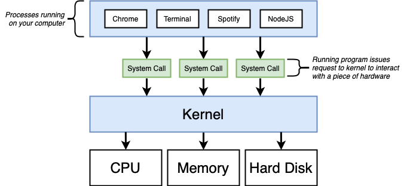
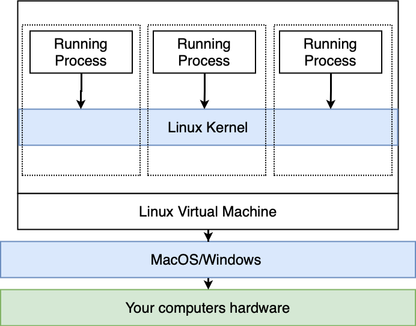
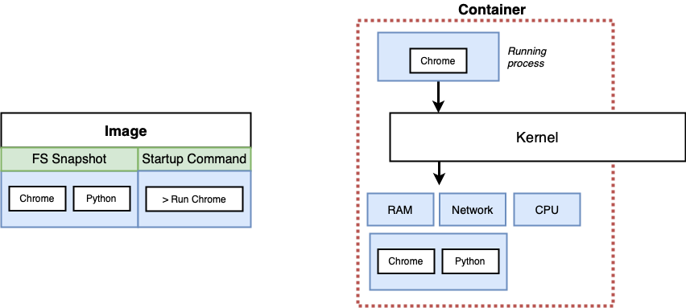
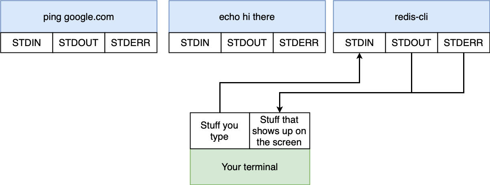
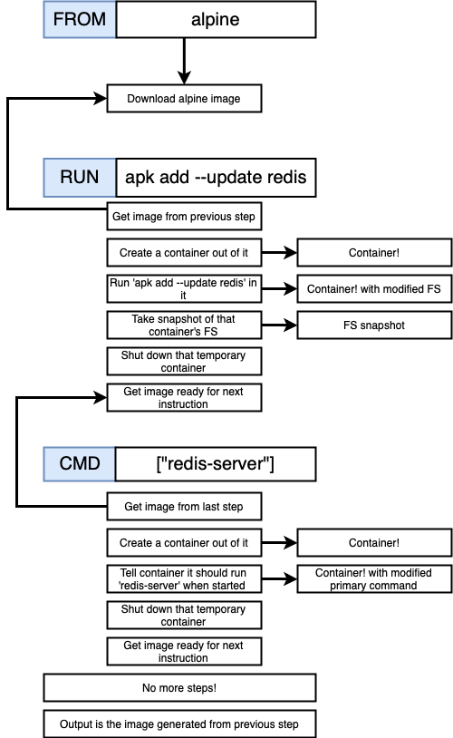

# Docker and Kubernetes: The complete guide

## Section 1: Introduction

### The Docker ecosystem

Docker is an ecosystem for creating and running **containers**

The Docker ecosystem consists of:

- Docker **Client** (CLI)
- Docker **Server** (Daemon)
- Docker **Machine**
- Docker **Images**
- Docker **Hub**
- Docker **Compose**

An **Image** is a single file with all dependencies & configuration that is required to run a program.

A **Container** is an instance of an image. A container runs a program.

The docker **Client** (or CLI) allowed to interact with the **Docker Server** (or Daemon) using commands in order to
create images and run containers.

The `run` command starts a new container based on an image.

```bash
$ docker run hello-world
```

if a local copy of the image doesn't exist in the local cache of images, a new copy will be pull from the server and
will be instantiated.

### What is a container?

Before talking about containers we should take a brief overview of an OS structure:




#### Namespacing and Control groups

**Namespacing** is the process of isolating resources per process (or group of processes). 

For example:

- Processes
- Hard drive
- Network
- Users
- Hostnames
- Inter Process Communication

**Control groups** can be used to limit the amount of resources per process

For example:

- Memory
- CPU usage
- HD I/O
- Network Bandwidth

Namespacing and control groups are features specific to **Linux**, when installing docker on mac or windows, a **Linux**
VM is installed in the background.



When referring to the **container** we are essentially referring to the running process (e.g. chrome, nodeJS) 
**as well as** the segment of resources that it can talk to.

An image holds a "File System Snapshot" and a startup command.

When we "turn" an image into a container, the kernel will isolate a section of the hard drive and make it available to 
just this container, and the FS snapshot is copied into that segment of the HD. 




## Section 2 : Manipulating Containers with the Docker Client

A closer look into some of the docker commands and their output:

- `docker run <image_name> <startup_command>` - runs a container
    
    + `docker run` == `docker create` + `docker start`
    
    - **image_name** - the name of the image to run
    - **startup_command** - a command that is executed when the container starts up (overrides the default stratup command) 
    
    ```bash
    $ docker run busybox ls
    bin
    dev
    etc
    home
    proc
    root
    sys
    tmp
    usr
    var
    ```
    
    *note*: the busybox image has the `ls` and `echo` executables in its file system snapshot.
    
- `docker ps` - lists all running containers (adding `--all` will list also non running containers)
    
    ```bash
    $ docker ps --all
    CONTAINER ID        IMAGE               COMMAND             CREATED             STATUS                      PORTS               NAMES
    e198d4f2d08c        busybox             "ls"                10 minutes ago      Exited (0) 10 minutes ago                       infallible_dewdney
    70948c878d0c        busybox             "echo bye there"    10 minutes ago      Exited (0) 10 minutes ago                       zen_dhawan
    ec854374d371        busybox             "echo hi there"     11 minutes ago      Exited (0) 11 minutes ago                       inspiring_curran
    d704d40927ae        hello-world         "/hello"            2 hours ago         Exited (0) 2 hours ago                          hopeful_poincare
    ```

    a common use of the `ps` command is to find the id of a specific container.

-  `docker create <container_name>` - create a container
    
    ```bash
    $ docker create hello-world
    38734cc4663f2704e528442a21ecfa342f113ef2de36dd934aaf28cd33dd78fd
    ```
    **note**: The id on the created container is printed out

    * When a container is created, the file system snapshot it set up.

- `docker start -a <container_id>`
    
    **notes**: 

    - the `-a` flag makes docker watch for output from within the container and print it out to the local terminal

    - When a container starts, it means actually running the startup command.
    
    - When a container is *Exited*, it can be started back up by calling `dcoker start <container_id>`.

- `docker system prune` - deletes stopped containers and build cache (with all the images downloaded from docker hub).

- `docker logs <container_id>` - getting all of the output from a container.

    **note** the docker logs does **not** rerun the container.

- `docker stop <container_id>` - stop a running container by issueing a `SIGTERM` command (clean shutdown with cleanup)

- `docker kill <container_id>` - stop a running command by issuing a `SIGKILL` command (shuts down immediately without cleanup)

In many cases we might want to start another process inside an already running container. 
For example `redis-cli` needs to interact with redis server in order to work.
To do so, we will make use of the `exec` command

 - `docker exec -it <container_id> <command>` - execute a command inside a running container.
    
    - The **-it** flag allows to provide input to the container.
    - `-i` attaches the terminal to the `STDIN` channel of the running process
    - `-t` makes sure that all the text is nicely formatted

    ```bash
    $ docker ps
    CONTAINER ID        IMAGE               COMMAND                  CREATED             STATUS              PORTS               NAMES
    70dcaacef58a        redis               "docker-entrypoint.s…"   6 minutes ago       Up 6 minutes        6379/tcp            pensive_dijkstra
    $ docker exec -it 70dcaacef58a redis-cli
    127.0.0.1:6379> set myvalue 3
    OK
    127.0.0.1:6379> get myvalue
    "3"
    ```

    Often times we would want to gain terminal or shell access to the running container:

    - `docker exec -it <container_id> sh` - opens the shell of the container
    
    **note**: `sh` is a program which is a command processor or a shell.

***Linux Sidenote***:

Every process in a linux environment has 3 communication channels: `STDIN`, `STDOUT` & `STDERR` attached to it, which are used to communicate information either into or out of a process.

`STDIN` is used to communicate into the process. the stuff we type in the terminal is being directed into a running `STDIN` channel attached to a process

`STDOUT` conveys information coming out of the process.

`STDERR` conveys information coming out of the process that is "error in nature"




***Important note***: 2 containers **do not** automatically share the same file system. In order for 2 containers to share the same file system we need to specifically form up a connection between them.


## Section 3 - Building Custom Images Through Docker Server

Building a custom image is done by creating a `Dockerfile` and writing some configuration into it which will define how the container should behave.

The `Dockerfile` is sent to the docker server via the docker client which will then build a usable image.

### The general flow a Dockerfile

1. Specify a **base image**:    
2. Run some commands to install additional programs 
3. Specify a command to run on startup.

### The general structure of a Dockerfile

```
[INSTRUCTION] [ARGUMENTS]
[INSTRUCTION] [ARGUMENTS]
.
.
.
[INSTRUCTION] [ARGUMENTS]
``` 

### Practical Example: Create an image that runs redis-server:

Dockerfile: 

```docker
# Use an existing docker image as a base
FROM alpine

# Download and install a dependency
RUN apk add --update redis

# Tell the image what to do when it starts as a container
CMD ["redis-server"] 
```

and then:
```bash
$ docker build .
...
Successfully built ab5846e5b220

$ docker run ab5846e5b220
...
1:M 21 Dec 13:06:48.603 * Ready to accept connections
```

### Breaking down the Dockerfile commands

- `FROM`: specify the docker image we want to use as a base
- `RUN`: execute some command while preparing the custom image
- `CMD`: specify what should be executed when the image is used to startup a new container

### What is Alpine? What is `apk`?

Alpine is an image that includes a default set of programs that are useful for installing and running redis.

In this case the useful command we used to create redis was `apk` (a package manager program)

### The build process in detail

`docker build <build_context>`

The *build context* is the set of files and folders that belong to our project.

1. `FROM alpine` 
    
    - downloaded the alpine image from docker hub
    
    ```bash
    Step 1/3 : FROM alpine
    latest: Pulling from library/alpine
    cd784148e348: Pull complete
    Digest: sha256:e1d4a235da8e7700f5f31d9f7130954b8cf64403e05f8fbb460cef138d90b2b3
    Status: Downloaded newer image for alpine:latest
     ---> 3f53bb00af94
    ```

2. `RUN apk add --update redis`
    
    - looked at the previous command in the Dockerfile (`FROM apline`)
    
    - took the image that was create in the previous step and created a new temporary container from that image
    
    - executed the command `apk add --update redis` as a process inside the temporary container 
    
    - stopped the temp. container
    
    - took a file system snapshot of the temp. container and save it as a temporary image.
    
    ```bash
    Step 2/3 : RUN apk add --update redis
     ---> Running in c7fccebec517
    fetch http://dl-cdn.alpinelinux.org/alpine/v3.8/main/x86_64/APKINDEX.tar.gz
    fetch http://dl-cdn.alpinelinux.org/alpine/v3.8/community/x86_64/APKINDEX.tar.gz
    (1/1) Installing redis (4.0.11-r0)
    Executing redis-4.0.11-r0.pre-install
    Executing redis-4.0.11-r0.post-install
    Executing busybox-1.28.4-r2.trigger
    OK: 6 MiB in 14 packages
    Removing intermediate container c7fccebec517
     ---> 8e04e07cfa8f
    ```   

3. `CMD ["redis-server"]`
    
    - look at the image from the previous step
    
    - create a new temporary container out of it
    
    - tells the container that its primary command should be `redis server`
    
    - shuts down the intermediate container
    
    - takes a snapshot of the file system and its primary command, and saves it as an image  
    
    ```bash
    Step 3/3 : CMD ["redis-server"]
     ---> Running in 4f897d0f2bc3
    Removing intermediate container 4f897d0f2bc3
     ---> ab5846e5b220
    Successfully built ab5846e5b220
    ```



### Rebuilds with Cache

Whenever we run a series of commands in the Dockerfile that have already been run the past, docker will use the cached 
images to run these commands again (unless the cache is cleaned with `docker system prune`).

If a new command has been added to the docker file, or the order o previous commands have chamged, then docker will 
create a new container and image, and also save that image to the cache.

### Tagging an image

An easier way to refer to an image (instead of copying and pasting long ids), is to give custom names to the image.

`docker build -t <tag_name> <build_context>`

The convention for image tags is: 
`<docker_id>/<project_name>:<version>`

for example:
`docker build -t erant10/redis:latest .`

### Manual image generation with docker commit

- installing redis on the alpine image:
    
    ```bash
    $ redis-image docker run -it alpine sh
    / # apk add --update redis
    fetch http://dl-cdn.alpinelinux.org/alpine/v3.8/main/x86_64/APKINDEX.tar.gz
    fetch http://dl-cdn.alpinelinux.org/alpine/v3.8/community/x86_64/APKINDEX.tar.gz
    (1/1) Installing redis (4.0.11-r0)
    Executing redis-4.0.11-r0.pre-install
    Executing redis-4.0.11-r0.post-install
    Executing busybox-1.28.4-r2.trigger
    OK: 6 MiB in 14 packages
    ```

- specifying the default command on startup:

    ```bash
    $ redis-image docker ps
    CONTAINER ID        IMAGE               COMMAND             CREATED              STATUS              PORTS               NAMES
    9fde27d4a817        alpine              "sh"                About a minute ago   Up About a minute                       pensive_torvalds
    $ redis-image docker commit -c 'CMD ["redis-server"]' 9fde27d4a817
    sha256:75e8685b60934463d0af9c280e12fb4b4ba555beec29c57f38db54a2d067e509
    ```

- running the newly created container:

    ```bash
    $ redis-image docker run 75e8685b6093446
    .
    .
    .
    Ready to accept connections
    ```


## Section 4 - A real project with Docker

We will create a simple web app with nodeJS, purposely making some common mistakes along the way.

**index.js**

```js
const express = require('express');

const app = express();
const port = 8080;
app.get('/', (req,res) => {
    res.send('Hi there!');
});

app.listen(port, () => {
   console.log(`listening on port ${port}`);
});
```

**Dockerfile**

```dockerfile
# Specify a base image
FROM alpine

# Install some dependencies
RUN npm install

# Default command
CMD ["npm", "start"]
```

### Alpine

The *alpine* image is **very** lightweight and it contains only a few basic unix programs and it does **not** include 
node and npm.

In general, alpine is a term in the docker world for an image that is as small and compact as possible. Many popular 
repositories will offer an alpine version of their image. 

Usually images in the docker hub has multiple versions with certain additions to the base image. to use those 
versions we just need to add a tag to the `FROM` command in the `Dockerfile`

##### Mistake 1

Running `docker build .` will throw the error: `/bin/sh: npm: not found`

There are 2 possible solutions:

1. Find a different image that has npm pre-installed (from docker hub).

2. build our own image from scratch

**Solution**

We will use the node image

**Dockerfile**

```dockerfile
FROM node:alpine
RUN npm install
CMD ["npm", "start"]
```

##### Mistake 2

`package.json` is not available inside the container:

```
npm WARN saveError ENOENT: no such file or directory, open '/package.json'
```

The only files that are available are the ones that came with the FS snapshot from the node image.

In general, when we build an image, none of the files inside of the project directory are available within the container
by default unless we **specifically allow it** inside the `Dockerfile`.

**Solution**

The `COPY` instruction is used to move files and folders from our local machine to the file system that is created in 
the container.

**Dockerfile**

```dockerfile
FROM node:alpine
COPY ./ ./
RUN npm install
CMD ["npm", "start"]
```

At this point we were able to create the image successfully.

```
Sending build context to Docker daemon  4.096kB
Step 1/4 : FROM node:alpine
 ---> ebbf98230a82
Step 2/4 : COPY ./ ./
 ---> Using cache
 ---> 5ac48dfbdef2
Step 3/4 : RUN npm install
 ---> Using cache
 ---> 0e68c7ddf32c
Step 4/4 : CMD ["npm", "start"]
 ---> Using cache
 ---> da9b25e9a84a
Successfully built da9b25e9a84a
Successfully tagged erant10/simpleweb:latest
```

##### Mistake 3

By default, no traffic that is coming into the local network is routed into the container, which has its own **isolated** 
set of ports that can receive traffic.  

Therefore at this point we cannot make any requests to the express server that is listening within the container.

**Solution**

In order to make sure that any request from outside will be redirected into the container, we need to set up an explicit
**port mapping**.

This is not done inside the `Dockerfile`, because it is a **runtime constraint**, which can only be changed when 
running a container.

The syntax to port mapping:

```bash
docker run -p <localhost_incoming_requests_port>:<port_inside_the_container> <image_name> 
```

in our case:

```bash
docker run -p 8080:8080 erant10/simpleweb
```

##### Mistake 4

It is considered bad practice to set up the project inside the image's root directory (since it might cause conflicts 
with system directories).

**Solution**

Change the Dockerfile with the `WORKDIR <project_folder>` instruction.

Any commands/instructions following the `WORKDIR` command will be executed relative to the specified folder

**Dockerfile**

```dockerfile
FROM node:alpine
WORKDIR /usr/app
COPY ./ ./
RUN npm install
CMD ["npm", "start"]
```


##### Note - unnecessary rebuilds

Any time we modify the source files, they will **not** be automatically applied to the project inside the container.

If we want to **automatically** update the file inside the container we will have to change some configuration (which 
we will do later).

Another option is to rebuild the container and restart the express server, however this means that every change we make 
to the express server files, the `COPY` instruction will be executed again (since it cannot use a cached version), 
and then `RUN npm install` again, which will install all the dependencies over and over. 

We can avoid this by splitting the **COPY** instruction into 2, first copying **only** the `package.json` file and then
the rest of the source files:

```dockerfile
FROM node:alpine
WORKDIR /usr/app
COPY ./package.json ./
RUN npm install
COPY ./ ./
CMD ["npm", "start"]
```
